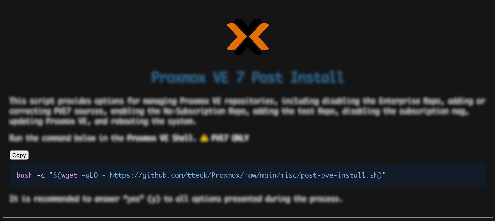

<h1><p align="center"><a href="https://tteck.github.io/Proxmox/">Proxmox VE Helper Scripts</a></p></h1>

> _Please always be cautious and thoroughly evaluate scripts and automation tasks obtained from external sources._

## Functional Goals

- These scripts allow for the creation of a Linux container or virtual machine in an interactive manner, with options for both basic and advanced configurations.
- The basic setup uses default settings, while the advanced setup offers the possibility to modify the settings.
- The options are presented in a dialog box format using the **whiptail** command and the script collects and validates the user's input to generate the final configuration of the container or virtual machine.

## Usage

- **Network Download** - all scripts can be deployed to a Proxmox console by going to the [website](https://tteck.github.io/Proxmox/), choosing a script, and then copying the one-line script to the console:

    

- **Git Clone** - by cloning this repo into a directory on a Proxmox server you have access to the same script choices via the popular [`just`](https://github.com/casey/just) command runner:

    ```sh
    # list all available scripts and ENV vars
    just
    # example: run PVE post install script
    just pve-post-install
    ```

    > **Note:** your Proxmox server will _not_ have `just` installed by default but you can install it with `apt install just`

## Other Resources

- [User Submitted Guides]() - _user submitted guides to installing software which this repo helps to bootstrap with it's scripts_
- [Code Overview]() - _quick overview of key parts of this repo's code/scripts for any future contributors to get a better handle on where things are_

## Contributing

Everybody is invited and welcome to contribute to Proxmox VE Helper Scripts.

- Pull requests submitted against [**main**](https://github.com/tteck/Proxmox/tree/main) are meticulously scrutinized, so please do not take it personally if the project maintainer rejects your request. By adhering to the established patterns and conventions throughout the codebase, you greatly increase the likelihood that your changes will get merged into [**main**](https://github.com/tteck/Proxmox/tree/main).

- It is important to stress that complaining about the decision after it has been made is not productive behavior for the pull request submitter. It is crucial for all contributors to respect the decision-making process and collaborate effectively towards achieving the best possible outcome for the project.

---
> **NOTE:** Proxmox® is a registered trademark of Proxmox Server Solutions GmbH.
